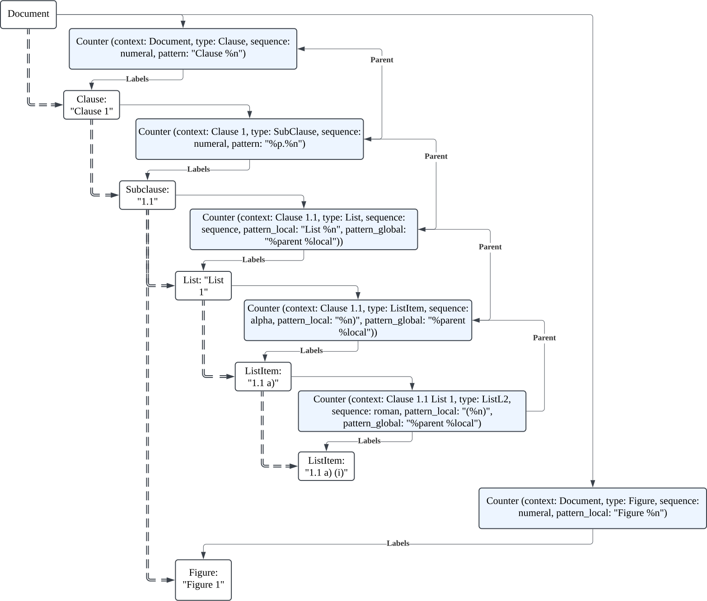
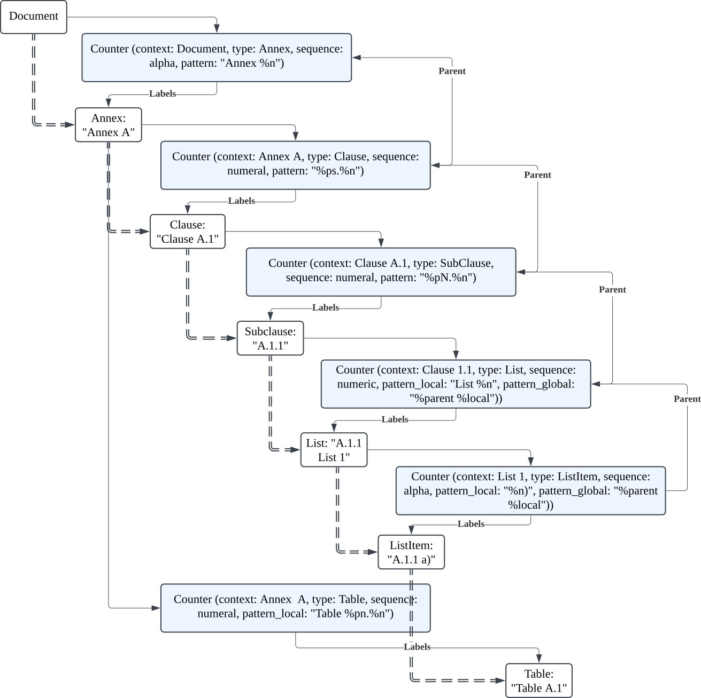

= MN 112: Label Auto-assignment Definition Language (LADL) specification
:docnumber: 112
:edition: 1
:revdate: 2025-02-28
:copyright-year: 2025
:language: en
:title-main-en: Label Auto-assignment Definition Language (LADL) specification
:doctype: standard
:status: draft
:mn-document-class: ribose
:mn-output-extensions: xml,html,pdf,rxl
:local-cache-only:

[[introduction]]
== Introduction

This specification defines the Label Auto-assignment Definition Language (LADL), a
declarative modeling language for defining automatic label assignment requirements
across technical documentation and publishing systems.

NOTE: "LADL" is pronounced as "ladel".

Label auto-assignment is a critical component of structured documentation, enabling
consistent referencing and organization of content elements throughout a document.
The act is to automatically create correct Label objects that attach to the content
element. A Labeller creates a string label from a Label object, depending on the usage
context (e.g., the same item can be labelled differently in different parts of the
content hierarchy).

LADL addresses these challenges with:

. platform-independent labeling model that works consistently across rendering engines
. built-in support for international labeling systems (including CJK)
. hierarchical labeling with contextual awareness and scope binding
. clear separation between semantic structure and presentation formatting
. support for transformations to CSS, Word Styles, and XSLT labellers
. string pattern interpolation for flexible label construction

LADL enables document architects and standards developers to define once and apply
everywhere, ensuring that labeling schemes work predictably across all outputs
while preserving both semantic structure and visual presentation requirements.

[[scope]]
== Scope

This document defines a label definition language called the
"Label Auto-assignment Definition Language" (LADL)
for defining auto-labeling schemes.

It also defines requirements for auto-labeling systems that can perform the
necessary labeling activity based on the defined schemes.

It is a platform-independent, language-agnostic labeling model, allowing
defined schemes to be deployed towards various rendering formats.

[[terms-and-definitions]]
== Terms and definitions

=== label

machine-readable object that attaches to a content element for consistent and
unambiguous reference of information in an information container

[example]
====
A label like "1.1.2" indicates it is the "first clause in document, first subclause, second subsubclause", while "Figure A.2" means it is the second image in Annex A.
====

=== labeller

numeric or alphanumeric variable that tracks sequence position within a document context

=== sequence

ordered progression of values following defined rules for generation and formatting

=== labeling format

rules for representing a labeller value in a particular alphanumeric system

[example]
====
Arabic numerals, Roman numerals, alphabetic characters.
====

=== label context

document boundary within which a labeller operates, defining when the labeller resets or continues

=== string interpolation

process of substituting variable placeholders in a pattern with actual values to construct a rendered label

=== label template

template combining labeller values and literal characters to form string labels

[example]
====
"Figure %n" is a template that generates labels like "Figure 1", "Figure 2", etc.
====

=== hierarchical labeling

labeling system where elements inherit context from parent elements

[example]
====
In a labeling system, "1.1.2" can represent the locality of "section 1,
subsection 1, clause 2".
====

=== labeller

component that assigns labels to content elements based on their position in the
document structure and labeling context, and generates a human-readable label in
string form from a label object

=== reference

general term for pointing to specific content elements using labels, enabling
navigation, identification, and citation

=== local reference

reference to content within the same context or document section, using labels
to provide precise location information

=== global reference

reference to content across different contexts or document sections, using
labels to provide unambiguous identification regardless of location

=== citation

formal reference to content using labels, enabling precise identification in
both internal and external referencing systems

[[requirements]]
== Principles and requirements

=== Purpose

Labels serve as the foundation for consistent and unambiguous reference of
information within documents.

Their primary purpose is to enable:

* *Precise navigation* through hierarchical document structures
* *Unambiguous identification* of content elements regardless of their position
* *Citation systems* that work both internally and externally to the document

Labels provide machine-readable identifiers that can be rendered in
human-readable form, allowing both automated systems and human readers to locate
and reference specific content with precision.

A consistent, predictable auto-labeling language enables consistent, predictable
auto-labeling with the following benefits:

* Preserving semantic relationships between labeled elements
* Adapting to different display requirements by format
* Supporting internationalization requirements
* Allowing for hierarchical labeling schemes
* Enabling flexible formatting of labels
* Managing labeller scopes across document boundaries
* Ability to deploy to different rendering engines, such as CSS, Word Styles,
and XSLT.

[[principles]]
=== Principles

LADL follows these fundamental design principles:

Semantics and presentation separation::
Numbers represent both position in a sequence and
visual labeling. These concerns must be separable for proper processing.

Context awareness::
Labeling systems must understand their position within content hierarchies.

Format-independence::
The model must define labeling in a way that can be consistently applied across
multiple forms of media.

Implementation-free::
The defined labeling system must not depend on any specific rendering engine or
language outside of LADL.

Internationalization support::
Non-Latin labeling systems, including right-to-left languages, must be fully
supported.

Extensible::
Support for complex labeling schemes required by standards organizations.

=== Reference resolution from labels

The process of resolving references involves:

. *Identification*: Determining the target element based on its label

. *Context mapping*: Understanding the relationship between the reference
context and the target context

. *Rendering*: Presenting the reference in an appropriate format for the current
context

The LADL model provides the foundation for this resolution process by ensuring
that labels are:

* *Unique*: Each label uniquely identifies a specific content element

* *Structured*: Labels follow a consistent structure that reflects the document
hierarchy

* *Context-aware*: Labels can be interpreted correctly regardless of where they
appear

=== Label reference types

==== General

Labels support different types of references depending on their scope and usage:

* *Global references* point to content across different contexts
* *Local references* point to content within the same context
* *Citations* provide formal references to external content

==== Global references

A global reference label is a unique reference that refers to content scoped
within an information container.

Global references require string labels that include all necessary context
information to ensure unambiguous identification.

A label reference is considered fully-qualified as a global reference if:

* All its labeling contexts are shown in the label
* The label uniquely refers to a content element within the container

[example]
====
A reference from Annex A to "Figure 3.2" clearly identifies the second figure in
Clause 3, regardless of where the reference appears.
====

==== Local references

A local reference label is a unique reference that refers to content scoped
within a part of the information container.

[example]
====
Within Clause 3, a reference to a list item "a)" is a local reference instead of
the global reference counterpart of "Clause 3, a)".
====

Local references can be preferred over global references when referring content
within the same context is more concise for the reader, due to omission of the
duplicated self-reference.
+
[example]
====
Within a list, a reference to "a)" is more concise than "List 1, a)".
====

==== Citations

Citations are external references to the information container that the labels
are attached to.

Citations to labelled content in the current environment may be created
by external document references or in bibliographic entries.

For external users to create consistent citations to the content, the labels
must be predictable and consistent across different documents.

=== Runtime requirements

The LADL language runtime is responsible for interpreting and executing label
auto-assignment definitions. The runtime:

* Processes LADL definitions to create a label assignment model
* Maintains labeller states and sequences throughout document processing
* Manages context hierarchies and inheritance relationships
* Executes label generation according to defined patterns
* Handles format-specific rendering requirements

== Architecture

=== General

The LADL architecture consists of:

* Core models
* Hierarchical context management
* Context hierarchy framework
* Hierarchical pattern interpolation

.Document clause hierarchy and labellers

.Document annex hierarchy and labellers

This diagram demonstrates how:

* The LabelingContext is different from the actual content hierarchy

* Elements may be labeled according to a higher label context even if they
belong to a lower document hierarchy

* Some elements are labeled according to label contexts belonging to the
document hierarchy

The diagram illustrates the critical distinction between content hierarchy and
label context in the LADL model:

* *Double dashed lines* represent content hierarchy (e.g., document containing clauses containing subclauses)
* *Unlabeled directional lines* represent ownership (e.g., document owning a ClauseLabeller and an AnnexLabeller)
* *Lines labeled "Parent"* show labeller inheritance relationships between parent and child labellers
* *Lines labeled "Labels"* show where a Labeller/Labeller assigns a Label to a content element

The diagram also illustrates the 3 key model trees in the LADL model:

* *Content tree*: Contains models that can be used to contain ContentElements
that have Labels. These are boxes in white.

* *Context tree*: Made of LabelContext objects that provide label contexts.
These are the boxes in brown.

* *Labeller tree*: Made of Labeller objects that allow hierarchical labeling.
These are boxes in blue.

[[core-models]]
== Core models

=== General

The core models in the LADL language framework are:

* `Label`: Represents a label assigned to a content element
* `Labeller`: Transforms a label template into a final label string
* `Sequence`: Defines the progression of values for a labeller
* `LabelContext`: Defines the scope and type of label context for labeling elements
* `LabelTemplate`: Defines how labeller values are combined with fixed text to create labels

In this document, we define the following models for illustration purposes of
the LADL language:

* `ContentElement`: Represents a content element in an information container

The following 3 model trees exist in the LADL model:

* Content tree: an object tree that contains models that can
be used to contain ContentElements that have Labels.

* Context tree: an object tree made of LabelContext objects (linked via the `parent` attribute) that provides label contexts.

* Labeller tree: an object tree made of Labeller objects (linked via the `parent` attribute) that allows hierarchical labeling.

The following diagrams illustrate the key relationships in the LADL model.

.Scope and Element Binding
[source]
----
+----------------+         +----------------+
|    Labeller     |<------->|     Scope      |
|----------------|         |----------------|
| id             |         | context        |
| sequence       |         | boundary       |
+----------------+         +----------------+
        |
        |                  +----------------+
        +----------------->|  ElementType   |
                           |----------------|
                           | name           |
                           | attributes     |
                           +----------------+
----

=== ContentElement

The ContentElement class represents a content element in an information
container that can potentially hold a LabelContext object.

[source,lml]
----
class ContentElement {
  attribute id, String {
    definition "Unique identifier for the content element"
  }
  attribute parent, ref:(ContentElement) {
    definition "Parent element to which this element belongs"
  }
  attribute type, String {
    definition "Type of the content element"
  }
}
----

The `type` attribute is used to match whether a Labeller can label it.

A ContentElement must be associated with a LabelContext object if it has
children to be labeled.

Every ContentElement that can either:

* Serve as a label context
* Be labeled

=== Sequence

==== General

A sequence defines the progression of values used for labeling.

There are two types of Sequence models that inherit from Sequence:

* CharacterSequence: Defines a fixed sequence of characters
* NumericSequence: Defines a monotonic sequence of numerical values

[source,lml]
----
class Sequence {
  attribute char_direction, String {
    definition "Whether the sequence contains characters in a left-to-right or right-to-left direction"

    default "ltr"
    values {
      value "ltr" {
        definition "Left-to-right"
      }
      value "rtl" {
        definition "Right-to-left"
      }
    }
  }
  method value_for_position(position: Integer) {
    definition "Provide the value for a given order in the sequence"
  }

  method set_initial_value(position: Integer) {
    definition "Set the sequence to start at a specific value"
  }
}
----

==== NumericSequence

[source,lml]
----
class NumericSequence < Sequence {
  attribute initial_value, Integer {
    definition "Starting value for the sequence"
    default: 1
  }
  attribute increment, Integer {
    definition "Value to increment by for each step"
    default: 1
  }
  attribute cycle_length, Integer {
    definition "Length after which sequence notation expands"
  }
  attribute base_sequence, Sequence {
    definition "Base sequence that this sequence builds upon"
  }
}
----

A LADL-compliant runtime should provide the following default labeling
sequences:

Left-to-right sequences::

`DecimalNumericSequence`::: Standard decimal numbers (1, 2, 3...)
`RomanUpperNumericSequence`::: Uppercase Roman numerals (I, II, III...)
`RomanLowerNumericSequence`::: Lowercase Roman numerals (i, ii, iii...)
`AlphaUpperNumericSequence`::: Uppercase letters (A, B, C...)
`AlphaLowerNumericSequence`::: Lowercase letters (a, b, c...)
`CyrillicUpperCharacterSequence`::: Uppercase Cyrillic alphabet characters (А, Б, В, Г, Д, Е, Ж, З...)
`CyrillicLowerCharacterSequence`::: Lowercase Cyrillic alphabet characters (а, б, в, г, д, е, ж, з...)
`GreekUpperCharacterSequence`::: Uppercase Greek alphabet characters (Α, Β, Γ, Δ, Ε, Ζ, Η, Θ...)
`GreekLowerCharacterSequence`::: Lowercase Greek alphabet characters (α, β, γ, δ, ε, ζ, η, θ...)
`ChineseNumericSequence`::: Chinese numerals (一, 二, 三...)
`JapaneseNumericSequence`::: Japanese numerals (一, 二, 三...)
`KoreanNumericSequence`::: Korean numerals (일, 이, 삼...)

Right-to-left sequences::

`ArabicNumericSequence`::: Arabic numerals in Arabic script (١, ٢, ٣...). This is a sequence of RTL numbers.
`HebrewNumericSequence`::: Hebrew numerals (א, ב, ג...). This is a sequence of RTL numbers.

.An Arabic numeric sequence that increments by 3
[example]
====
The following definition describes a custom numeral sequence based on
ArabicNumericSequence that jumps every 3 positions.

[source,lml]
----
instance ThreeIncrementArabicNumericSequence < NumericSequence {
  base_sequence = ArabicNumericSequence
  initial_value = 1
  increment = 3
}
----

Produces a sequence of "1, 4, 7, 10, ...".
====

.A Chinese numeric sequence that only gives even numbers
[example]
====
The following definition describes a custom numeric sequence based on Chinese
numeric sequence only giving even numbers.

[source,lml]
----
instance EvenChineseNumericSequence {
  base_sequence = ChineseNumericSequence
  initial_value = 2
  increment = 2
}
----

Produces a sequence of "二, 四, 六, 八, ...".
====

==== CharacterSequence

[source,lml]
----
class CharacterSequence < Sequence {
  attribute characters, String {
    definition "Strings that define a label for an ordered element in the sequence"
    cardinality 1..n
  }
  attribute expansion_rule, String {
    definition "Rule for expanding sequence after completion"
    values {
      value "repeat_label" {
        definition "Repeat the label character"
      }
      value "prepend_prefix" {
        definition "Add a new prefix character"
      }
      value "double_character" {
        definition "Double the character for expansion"
      }
      value "none" {
        definition "No expansion applied"
      }
      value "append_suffix" {
        definition "Append a suffix character after expansion"
      }
    }
  }
  attribute direction, String {
    definition "Direction of the sequence"
    default "ltr"
    values {
      value "ltr" {
        definition "Left-to-right"
      }
      value "rtl" {
        definition "Right-to-left"
      }
    }
  }
}
----

[example]
====
Certain ancient texts apply a labeling system of ["元", "亨", "利", "貞"] as
book labels if there are 4 books in a series. The following definition applies
the expansion rule "prepend_prefix" to the sequence.

[source,lml]
----
instance YiJingCharacterSequence {
  characters = ["元", "亨", "利", "貞"]
  expansion_rule = "prepend_prefix"
  expansion_prefix = ["乾", "坤", "巽", "震", "坎", "艮", "離", "兌"]
}
----

Produces a sequence of "元, 亨, 利, 貞, 乾元, 乾亨, 乾利, 乾貞, 坤元, 坤亨, ...".
====

[example]
====
Greek literature uses the Greek alphabet and numerals for labeling, which
includes both letters and specific numeral characters for enumeration. The
following definition applies the expansion rule "double_character" to the
sequence.

[source,lml]
----
instance GreekCharacterSequence {
  characters = ["α", "β", "γ", "δ", "ε", "ζ", "η", "θ"]
  expansion_rule = "double_character"
}
----

Produces a sequence of "α, β, γ, δ, ε, ζ, η, θ, αα, ββ, γγ, δδ, εε, ...".
====

=== Label template

The LabelTemplate class defines how string labels are constructed from labeller
values and fixed text.

[source,lml]
----
class LabelTemplate {
  attribute pattern, String {
    definition "Template string with placeholders for labeller values"
  }
  attribute direction, String {
    definition "Direction of the pattern string"
    default "ltr"
    values {
      value "ltr" {
        definition "Left-to-right"
      }
      value "rtl" {
        definition "Right-to-left"
      }
    }
  }
}
----

The `pattern` attribute is a string that contains placeholders for labeller
values and any fixed text necessary.

The following placeholders are supported:

`%n`:: Labeller value
+
[example]
====
The pattern `"Figure %n"` may generate labels like "Figure 1", "Figure 2",
"Figure 3", etc.
====

`%pn`:: Parent labeller value
+
[example]
====
The pattern `"Figure %pn.%n"`, where the parent is a labeller for an Annex
context, may generate the labels "Figure A.1", "Figure B.2", "Figure C.3".
====

`%parent`:: Rendered global label value of parent.
+
[example]
====
The pattern "%parent, List %n", where the parent is a labeller for a Clause
context, may generate the labels "Clause 1, List 1", "Clause 1, List 2", "Clause
2, List 1", etc.
====

`%self`:: Rendered local label value of self.
+
[example]
====
The pattern "%self" in a Clause labeller context, where the local reference template
is "Clause %n",
may generate the label "Clause 1", "Clause 2", "Clause 3".
====

The `direction` attribute defines the direction of the pattern string, which
can be either "ltr" (left-to-right) or "rtl" (right-to-left).

.An unordered list label template
[example]
====
The following definition describes a label template for unordered lists with no
string interpolation.

[source]
----
Level 1: •
Level 2: ◦
Level 3: ▪
----

[source,lml]
----
instance UnorderedListLabelLevel1Template {
  pattern = "•"
}

instance UnorderedListLabelLevel2Template {
  pattern = "◦"
}

instance UnorderedListLabelLevel3Template {
  pattern = "▪"
}
----
====

.A simple figure labeling pattern
[example]
====
The following definition describes a label template for figures that uses the
labeller value.

[source]
----
Figure %n
----

[source,lml]
----
instance FigureLabelTemplate < LabelTemplate {
  pattern = "Figure %n"
}
----

Output: "Figure 1", "Figure 2", "Figure 3", etc.
====

.A Japanese clause hierarchical labeling pattern
[example]
====
The following definition describes a label template for clauses that uses the
labeller value.

[source]
----
%parentの%n
----

[source,lml]
----
instance JapaneseClauseLabelTemplate < LabelTemplate {
  pattern = "%parentの%n"
}
----

If parent clause is labelled as "二", the sequence is the JapaneseNumericSequence,
the output would be "二の一", "二の二", "二の三", etc.

If parent clause is labelled as "二の三", the sequence is the
JapaneseNumericSequence, the output would be "二の三の一", "二の三の二", "二の三
の三", etc.
====

A label template can be in a RTL direction. The following rules apply:

* Numbers flow correctly from right-to-left
* Hierarchical labels maintain proper RTL rendering
* Global references preserve the RTL format when used in different contexts

.RTL clause labels
====
Arabic documents use right-to-left (RTL) text direction.

[source,lml]
----
instance ArabicClauseLabelTemplate < LabelTemplate {
  pattern = "%n قسم"
  direction = "rtl"
}

instance ArabicClauseLabelGlobalTemplate < LabelTemplate {
  pattern = "%n قسم، %parent"
  direction = "rtl"
}

instance ArabicClauseLabeller {
  id = "arabic_clause_labeller"
  sequence = ArabicNumericSequence // This is a sequence of RTL numbers
  context = DocumentContext
  type = "clause"
  template = ArabicClauseLabelTemplate
  global_template = ArabicClauseLabelGlobalTemplate
}
----

The values would be:
----
> ArabicClauseLabeller.value_for_position(1) => "١ قسم"
> ArabicClauseLabeller.value_for_position(2) => "٢ قسم"
> ArabicClauseLabeller.value_for_position(3) => "٣ قسم"
----
====

=== Label context

The LabelContext class defines the scope of labeling (and a label hierarchy) within
an information container.

----
class LabelContext {
  attribute name, String {
    definition "Name of the label context"
  }
  attribute parent, ref:(LabelContext) {
    definition "Parent label context to which this label context relates"
  }
  attribute element, ContentElement {
    definition "Content element associated with the label context"
  }
  attribute labellers, ref:(Labeller) {
    definition "Labellers (of different types) that are bound to this label context"
    collection true
  }
}
----

[example]
====
The following definition describes a label context for a document clause that
contains a labeller for figures.

[source,lml]
----
instance ClauseContext {
  name = "clause"
  parent = DocumentContext
  content_element = SomeClauseElement
  labellers = ["id:figure_labeller", "id:notes_labeller"]
}
----
====

=== Labeller

The Labeller model defines the fundamental mechanism for tracking sequence
position within a label context.

[source,lml]
----
class Labeller {
  attribute sequence, Sequence {
    definition "Sequence that defines the label's possible values"
  }

  attribute context, LabelContext {
    definition "LabelContext to which this labeller is bound"
  }

  attribute type, String {
    definition "Type of the ContentElement the labeller can label"
  }

  attribute parent, ref:(Labeller) {
    definition "Parent labeller to which this labeller relies upon to generate labels, if any"
  }

  attribute template, LabelTemplate {
    definition {
      Template for generating the label. The template direction must be
      respected when generating the label.
    }
  }

  attribute global_template, LabelTemplate {
    definition {
      Template for generating the fully qualified, global label. The template
      direction must be respected when generating the label.
    }
  }

  method value_for_position(position: Integer) {
    definition "Provide the rendered string label for local reference."
  }

  method global_value_for_position(position: Integer) {
    definition "Provide the rendered string label for global reference."
  }
}
----

.Labeller model
[source]
----
+-----------------+        +-------------------+
|    Labeller     |------->|  Sequence         |
|-----------------|        |-------------------|
| id              |        | initial_value     |
| context         |        | increment         |
| sequence        |        | cycle_length      |
| template        |        |                   |
| global_template |        |                   |
+-----------------+        +-------------------+
        |
        |                  +-------------------+
        +----------------->| LabelContext      |
        |                  |-------------------|
        |                  | name              |
        |                  | parent            |
        |                  | element           |
        |                  | labellers         |
        |                  +-------------------+
        |
        |                  +-------------------+
        +----------------->| Parent Labeller   |
                           |-------------------|
                           | id                |
                           | sequence          |
                           | context           |
                           | template          |
                           | global_template   |
                           +-------------------+
----

.Illustration of labelling a subclause as "1.1" with a parent labeller for "Clause 1"
[example]
====
[source]
----
+-------------------+         +-------------------+
| Parent Labeller   |  parent | Child Labeller    |
|-------------------|<--------|-------------------|
| id: "clause"      |         | id: "subclause"   |
| sequence: Arabic  |         | sequence: Arabic  |
| context: document |         | context: clause   |
+-------------------+         +-------------------+
          |                              |
          v                              v
+-------------------+         +-------------------+
| LabelTemplate     |         | LabelTemplate     |
|-------------------|   %pn   |-------------------|
| "Clause %n"       | <- - - -| "%pn.%n"          |
| -> "Clause 1"     |         | -> "1.1", "1.2"   |
+-------------------+         +-------------------+
----
====

.Illustration of labelling a figure as "Figure A.1", where A is the parent label (an annex)
[example]
====
[source]
----
+-------------------+         +-------------------+
| Annex Labeller    |         | Figure Labeller   |
|-------------------|<--------|-------------------|
| id: "annex"       |         | id: "figure"      |
| sequence: A,B,C.. |         | sequence: 1,2,3.. |
| context: document |         | context: annex    |
+-------------------+         +-------------------+
        |                               |
        v                               v
+-------------------+         +-------------------+
| Output: "A"       |         | Output: "1"       |
+-------------------+         +-------------------+
        |                               |
        |                               |
        v                               v
        +---------------+---------------+
                        |
                        v
               +---------------------+
               | Combined Pattern    |
               |---------------------|
               | "Figure %parent.%n" |
               | -> "Figure A.1"     |
               +---------------------+
----
====

.An unordered list label template
[example]
====
The following definition describes a labeller for unordered lists with no
string interpolation.

[source,lml]
----
instance UnorderedListLabelTemplate {
  pattern = "List %n"
}

instance UnorderedListLabelLevel1Template {
  pattern = "•"
}

instance UnorderedListLabelLevel2Template {
  pattern = "◦"
}

instance UnorderedListLabelLevel3Template {
  pattern = "▪"
}

instance UnorderedListLabeller {
  id = "unordered_list_labeller"
  sequence = CharacterSequence
  context = ClauseContext
  type = "list"
  template = UnorderedListLabelTemplate
}

instance UnorderedListLevel1Labeller {
  id = "unordered_list_labeller_1"
  sequence = CharacterSequence
  context = ClauseContext
  type = "list_item"
  template = UnorderedListLabelLevel1Template
}

instance UnorderedListLevel2Labeller {
  id = "unordered_list_labeller_1_1"
  sequence = CharacterSequence
  context = ClauseContext
  type = "list_item"
  template = UnorderedListLabelLevel2Template
  parent = UnorderedListLevel1Labeller
}

instance UnorderedListLevel3Labeller {
  id = "unordered_list_labeller_1_1_3"
  sequence = CharacterSequence
  context = ClauseContext
  type = "list_item"
  template = UnorderedListLabelLevel3Template
  parent = UnorderedListLevel2Labeller
}

// Content elements
instance ListContentElement < ContentElement {
  // Content element definition
  labellers = ["id:unordered_list_labeller"]
}
instance ListItem_1_ContentElement < ContentElement {
  // Content element definition
  labellers = ["id:unordered_list_item_labeller_1"]
}
instance ListItem_1_1_ContentElement < ContentElement {
  // Content element definition
  labellers = ["id:unordered_list_item_labeller_1_1"]
}
instance ListItem_1_1_3_ContentElement < ContentElement {
  // Content element definition
  labellers = ["id:unordered_list_item_labeller_1_1_3"]
}
----

The values would be:

----
> UnorderedListLabeller.value_for_position(1) => "List 1"
> UnorderedListLabeller.value_for_position(3) => "List 3"

// Level 1, same per position
> UnorderedListLevel1Labeller.value_for_position(1) => "•"
> UnorderedListLevel1Labeller.value_for_position(8) => "•"

// Level 2, same per position
> UnorderedListLevel2Labeller.value_for_position(1) => "◦"
> UnorderedListLevel2Labeller.value_for_position(3) => "◦"

// Level 3, same per position
> UnorderedListLevel3Labeller.value_for_position(1) => "▪"
> UnorderedListLevel3Labeller.value_for_position(4) => "▪"
----
====

For hierarchical labeling, a Labeller may have a parent labeller that provides
label context for the current labeller's position in the parent labeller's label
context'.

[example]
====
Simple labeller for tracking Notes in a Clause.

[source,lml]
----
instance ClauseContext {
  labellers = ["id:notes_labeller"]
}

instance NotesLabeller {
  id = "notes_labeller"
  sequence = ArabicNumericSequence
  context = ClauseContext
  parent = null // Does not rely on a parent Labeller
  template = NoteLabelTemplate
  global_template = NoteGlobalLabelTemplate
}

instance NoteLabelTemplate < LabelTemplate {
  pattern = "NOTE %n"
}

instance NoteGlobalLabelTemplate < LabelTemplate {
  pattern = "%parent, %self"
}
----

The values would be:
----
> NotesLabeller.value_for_position(1) => "NOTE 1"
> NotesLabeller.value_for_position(2) => "NOTE 2"
> NotesLabeller.value_for_position(3) => "NOTE 3"
> NotesLabeller.global_value_for_position(1) => "Clause 1, NOTE 1"
> NotesLabeller.global_value_for_position(2) => "Clause 1, NOTE 2"
> NotesLabeller.global_value_for_position(3) => "Clause 1, NOTE 3"
----
====

[example]
====
Simple labeller for tracking Figures:

[source,lml]
----
instance ClauseContext {
  type = "section"
  labellers = ["id:figure_labeller"]
}

instance FigureLabeller {
  id = "figure_labeller"
  sequence = RomanUpperNumericSequence
    context = ClauseContext
  parent = null // Does not rely on a parent Labeller
  template = FigureLabelTemplate
  global_template = FigureGlobalLabelTemplate
}

instance FigureLabelTemplate < LabelTemplate {
  pattern = "Figure %n"
}

instance FigureGlobalLabelTemplate < LabelTemplate {
  pattern = "%parent, %self"
}
----

The values would be:
----
> FigureLabelTemplate.value_for_position(1) => "Figure I"
> FigureLabelTemplate.value_for_position(2) => "Figure II"
> FigureLabelTemplate.value_for_position(3) => "Figure III"
> FigureGlobalLabelTemplate.global_value_for_position(1) => "Section 1, Figure I"
> FigureGlobalLabelTemplate.global_value_for_position(2) => "Section 1, Figure II"
> FigureGlobalLabelTemplate.global_value_for_position(3) => "Section 1, Figure III"
----
====

=== Label

The Label model represents a label assigned to a content element.

[source,lml]
----
class Label {
  attribute value, String {
    definition "Value of the label"
  }
  attribute content_element, ContentElement {
    definition "Content element to which this label is assigned"
  }
}
----

[example]
====
The following definition describes a label for a figure with the value "Figure 1".

[source,lml]
----
instance FigureLabel {
  value = "Figure 1"
  content_element = SomeFigureElement
}
----
====

=== Label style

The LabelStyle class defines a full set of label models sufficient
to implement a coherent labeling system for a publisher.

[source,lml]
----
class LabelStyle {
  attribute name, String {
    definition "Name of the label style"
  }
  attribute labellers, Labeller {
    definition "Labellers that are bound to this label style"
    collection true
  }
  attribute sequences, Sequence {
    definition "Sequences that are bound to this label style"
    collection true
  }
  attribute templates, LabelTemplate {
    definition "Templates that are bound to this label style"
    collection true
  }
  attribute contexts, LabelContext {
    definition "Label contexts that are bound to this label style"
    collection true
  }
}
----

== Usage

=== Defining a label style

A label style (the LabelStyle class) represents a coherent collection of LADL
models that define a coherent labeling system for a document.

Steps to creating a label style are detailed below.

. Understand the ContentElement tree that will be labeled.

.. Consider the types of ContentElements to label.
+
[example]
====
In a content tree there may be clauses, annexes and notes.
====

.. Consider the label contexts of those ContentElements.
+
[example]
====
Consider whether a ContentElement type will have its label scoped by
the document, or a subclause.
====

.. Consider the templates that will be used to format the labels.
+
[example]
====
A clause may be labeled as "Clause 1", an annex as "Annex A", and a note as
"Note 1".
====

.. Consider whether the label for a ContentElement will differ between
global and local references.
+
[example]
====
The first ordered list item may be labelled locally as "a)", but globally as
"List N, a)".
====

. Define the LADL models from the bottom up, per type of ContentElement.

.. Specify the LabelTemplate for generating the label for the type of ContentElement.
+
[example]
====
A clause labeled as "Clause 1" is specified as a LabelTemplate with the pattern
"Clause %n", where the sequence used is ArabicNumericSequence.
====

.. Specify the Sequence for generating numbering formats if a custom implementation is required.
+
[example]
====
An Annex labeled as "Annex A" requires the sequence RomanUpperNumericSequence,
which is available by default.
====

.. Specify the LabelContext for the type of ContentElement.
+
[example]
====
A clause numbered according to a document-level scope requires a LabelContext that is
linked to the ContentElement(Document).
====

.. Construct the Labeller for the type of ContentElement using the defined models
in previous steps.
+
[example]
====
A labeller requires a sequence, context, template (local and maybe global),
potentially a parent labeller depending on whether the template incorporates the
ContentElement's parent's label.
====

. Construct the LabelStyle object with the defined models.

.Full label style definition of SimpleLabelStyle
[example]
====
The following definition describes a label style for a document with a clause
context and a figure labeller.

The desired outputs are:

For `ContentElement(Clause)`::
"Clause 1" for the clause labeller, with label context of the document,
identical global and local label.

For `ContentElement(SubClause)`::
"1.1" for the sub-clause labeller, with label context of the clause, identical
global and local label.

For `ContentElement(Figure)`::
"Figure 1" for the figure labeller, with label context of the document,
identical global and local label.

Assume that we have this ContentElement tree:

[source]
----
Document
  Clause 1
    Sub-clause 1
    Sub-clause 2
      Figure 1
  Clause 2
    Figure 2
    Sub-clause 1
    Sub-clause 2
      Sub-clause 1
      Sub-clause 2
----

The label contexts are:

* The DocumentContext scopes the labels of clauses and figures
* The ClauseContext scopes the labels of the first sub-clause level
* The SubClauseContext scopes the labels of all other sub-clause levels
* The Document scopes the labels of figures

[source]
----
Document
  Clause 1         [label scoped by Document: DocumentContext with ClauseLabeller]
    Sub-clause 1   [label scoped by Clause 1: ClauseContext with SubClauseLabeller]
    Sub-clause 2   [label scoped by Clause 1: ClauseContext with SubClauseLabeller]
      Figure 1     [label scoped by Document: DocumentContext with FigureLabeller]
  Clause 2         [label scoped by Document: DocumentContext with ClauseLabeller]
    Figure 2       [label scoped by Document: DocumentContext with FigureLabeller]
    Sub-clause 1   [label scoped by Clause 2: ClauseContext with SubClauseLabeller]
    Sub-clause 2   [label scoped by Clause 2: ClauseContext with SubClauseLabeller]
      Sub-clause 1 [label scoped by 2.2: SubClauseContext with SubClauseLabeller]
      Sub-clause 2 [label scoped by 2.2: SubClauseContext with SubClauseLabeller]
        Figure 3   [label scoped by Document: DocumentContext with FigureLabeller]
----

[source,lml]
----
instance SimpleLabelStyle {
  name = "Simple Label Style"
  labellers = ["id:figure_labeller", "id:clause_labeller", "id:subclause_labeller"]
  sequences = [ArabicNumericSequence]
  templates = [FigureLabelTemplate, ClauseLabelTemplate, SubClauseLabelTemplate]
  contexts = [DocumentContext, ClauseContext, SubClauseContext]
}

instance DocumentContext < LabelContext {
  name = "document"
}

instance ClauseContext < LabelContext {
  // One per clause, link to ContentElement(Clause)
  name = "clause"
  parent = DocumentContext
}

instance SubClauseContext < LabelContext {
  // One per subclause, link to ContentElement(Clause)
  name = "subclause"
  // Implementation set parent to ClauseContext
}

instance ClauseLabeller < Labeller {
  id = "clause_labeller"
  sequence = ArabicNumericSequence
  context = DocumentContext
  parent = null // Does not rely on a parent Labeller
  template = ClauseLabelTemplate
}

instance ClauseLabelTemplate < LabelTemplate {
  pattern = "Clause %n"
}

instance SubClauseLabeller < Labeller {
  id = "subclause_labeller"
  sequence = ArabicNumericSequence
  context = ClauseContext
  parent = ClauseLabeller // Rely on ClauseLabeller for parent label
  template = SubClauseLabelTemplate
}

instance SubClauseLabelTemplate < LabelTemplate {
  pattern = "%parent.%n"
}

instance FigureLabeller < Labeller {
  id = "figure_labeller"
  sequence = ArabicNumericSequence
  context = DocumentContext
  parent = null // Does not rely on a parent Labeller
  template = FigureLabelTemplate
  global_template = FigureGlobalLabelTemplate
}

instance FigureLabelTemplate < LabelTemplate {
  pattern = "Figure %n"
}

instance FigureGlobalLabelTemplate < LabelTemplate {
  pattern = "%parent, %self"
}
----
====

=== Algorithm to resolve the label for a content element

The following algorithm describe how to resolve the label for a ContentElement
object in a LADL-compliant runtime.

. From the ContentElement, find its applicable LabelContext object. The
applicable LabelContext object is one that has a Labeller that can label the
type of the ContentElement.

.. If the LabelContext object is on it, use it.

.. If not, navigate through its `parent`
attribute subsequently until the closest LabelContext object
is obtained.

. From the LabelContext object, find the Labeller object that is
applicable to the ContentElement.

. Ask the Labeller object to generate a label for the ContentElement.

.. The Labeller object will use its LabelTemplate object to generate the label.

... If the LabelTemplate requires a sequence element, it will ask its Sequence object to generate a value for the position of the ContentElement in the LabelContext.

... If the LabelTemplate requires a parent labeller, it will ask its parent Labeller object to generate a label for the ContentElement.

. Done.

[[auto-labeled-elements]]
[appendix]
== Elements often auto-labeled

=== General

Many types of content elements in technical documents are auto-labeled to
provide a consistent structure and reference system.

This annex provides examples of common auto-labeled elements for the reader's
reference.

=== Lists

Lists are among the most commonly labeled elements in documents, with both
ordered and unordered variants.

==== Ordered Lists

Ordered lists use sequential labellers to number items in a list, increasing in value with each new item. They may also include nested hierarchies for sub-items.

[example]
====
. Item 1
. Item 2
.. Sub-item 2.1
.. Sub-item 2.2
. Item 3
====

==== Unordered Lists

Unordered lists use non-sequential markers for visual distinction.

[example]
====
* Item A
* Item B
** Sub-item B.1
** Sub-item B.2
====

=== Clause labeling

Clauses form the primary structural elements of technical documents and use hierarchical labeling.

[example]
====
"Clause 1: Introduction"

"Clause 2: Background"

"Sub-clause 2.1: Context"

"Sub-clause 2.2: Importance"
====

=== Annex and appendix labeling

Annexes and appendices typically use different labeling schemes than the main document.

// TODO define Annex N, Annex A.N

[example]
====
"Annex A: Glossary"

"Annex B: References"

"Annex A, Appendix 1: Sample Data"

"Annex A, Appendix 2: Test Cases"
====

=== Figure labeling

Figures typically use a combination of sequential and hierarchical labeling.

// TODO define Figure N, Figure A.N, Figure A.N a)

[example]
====
"Figure 1: System Architecture"

"Figure A.2: Data Flow Diagram"
====

=== Table labeling

Tables use labeling schemes similar to figures but often with different presentation.

// TODO define Table N, Table A.N

[example]
====
"Table 1: Data Summary"

"Table A.2: Test Results"
====

=== Note labeling

Notes may appear throughout a document and are typically labeled within their label context.

// TODO define Note N, Note A.N

[example]
====
"NOTE 1: Important Information"

"Clause 2, NOTE 1: Additional Details"
====

=== Example labeling

Examples often follow similar label templates to notes.

// TODO define Example N, Example A.N

[example]
====
"EXAMPLE 1: Basic Usage"

"Clause 3, EXAMPLE 1: Advanced Features"
====

=== Requirement labeling

Requirements often need special labeling for traceability.

// EDITOR: Output: "REQ-1.1", "REQ-1.2", "REQ-2.1"

[example]
====
"REQ-1.1: System shall support multiple users"

"REQ-1.2: The system shall ensure data security"
====

[[annex-labeller-hierarchy]]
[appendix]
== Instance model examples

=== Illustration diagram

The following instance model definitions illustrate the relationships shown
in the diagram.

EDITOR: Add instance model definitions

=== ISO/IEC label style

The ISO/IEC label style originates from and implements the requirements of:

* the ISO/IEC Directives, Part 2
* the ISO House Style.

This style defines the labeling scheme used by ISO/IEC deliverables.

It defines the following labeling requirements:

==== ISO/IEC standard labeling scheme

The element labeling scheme for ISO/IEC is specified as follows.

.Clause labeling
[%header,cols="1,2,2"]
|===
|Element |Labeling specification |LabelContext

|Clause
|Local and global: "Clause 1", "Clause 2"...
|Document

|Subclause
|Local and global: "1.1", "1.2", "2.1.1"... +
Uses parent's sequence number
|Parent Clause

|Annex
|Local and global: "Annex A", "Annex B", "Annex AA"...
|Document

|Annex clause
|Local and global: "A.1", "A.2"...
|Annex

|Figure
|Local and global: "Figure 1", "Figure A.1" +
Subfigure: "Figure A.1 a)"
|Document (for main document) +
Annex (for annex figures)

|Table
|Local and global: "Table 1", "Table A.1"
|Document (for main document) +
Annex (for annex tables)

|NOTE
|Local: "NOTE 1", "NOTE 2"... +
Global: "Clause X, NOTE 1" +
Special case: If single note, simply "NOTE" without number
|Clause or Subclause

|EXAMPLE
|Local: "EXAMPLE 1", "EXAMPLE 2"... +
Global: "Clause X, EXAMPLE 1", "1.2.3, EXAMPLE 2"
|Clause or Subclause

|Formula
|Same pattern as Figure/Table
|Clause

|List
|Local and global: "List 1", "List 2", "List A.1"...
|Clause

|List item (unordered)
|All levels: "—"
|List (first level), Parent ListItem (subsequent levels)

|List item (ordered)
|First level: a), b), c)... +
Second level: 1), 2), 3)... +
Third level: i), ii), iii)... +
Fourth level: a), b), c)...
|List (first level), Parent ListItem (subsequent levels)
|===
