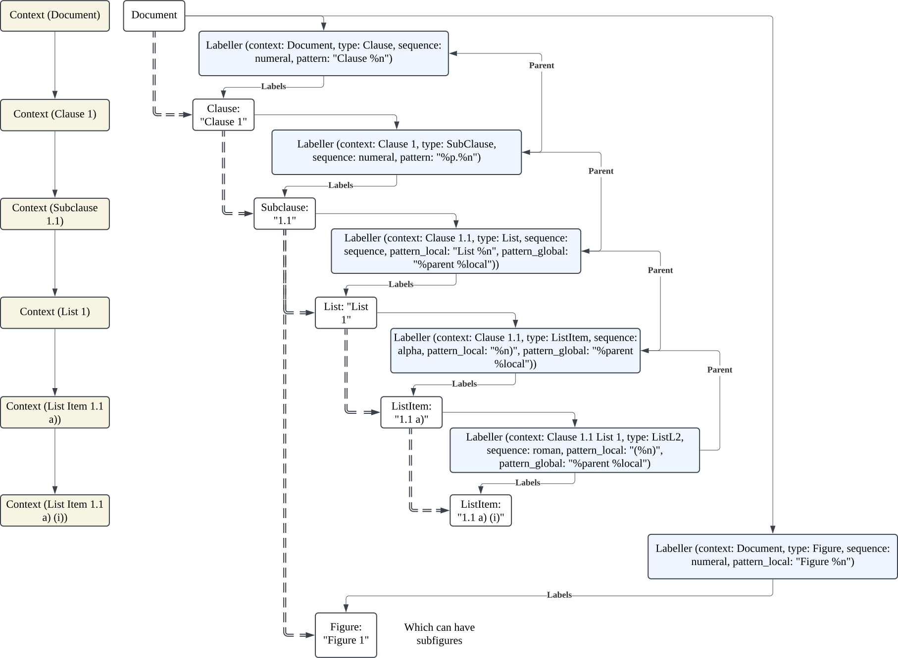
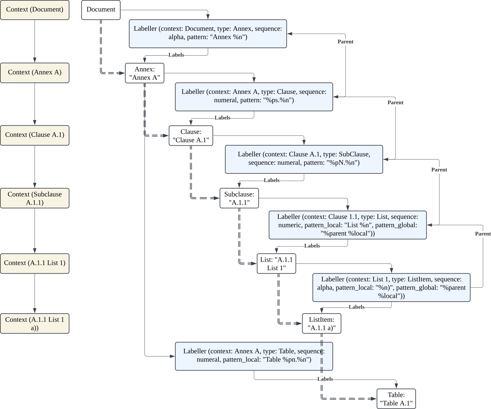

= MN 112: Label Auto-assignment Definition Language (LADL) specification
:docnumber: 112
:edition: 1
:revdate: 2025-02-28
:copyright-year: 2025
:language: en
:title-main-en: Label Auto-assignment Definition Language (LADL) specification
:doctype: standard
:status: draft
:mn-document-class: ribose
:mn-output-extensions: xml,html,pdf,rxl
:local-cache-only:

[[introduction]]
== Introduction

This specification defines the Label Auto-assignment Definition Language (LADL), a
declarative modeling language for defining automatic label assignment requirements
across technical documentation and publishing systems.

NOTE: "LADL" is pronounced as "ladel".

Label auto-assignment is a critical component of structured documentation, enabling
consistent referencing and organization of content elements throughout a document.
The act is to automatically create correct Label objects that attach to the content
element. A Labeller object labels things with machine understandable labels, while
a LabelRenderer creates a string label from a Label object, depending on the usage
context (e.g., the same item can be labelled differently in different parts of the
content hierarchy).

LADL addresses these challenges with:

. platform-independent labeling model that works consistently across rendering engines
. built-in support for international labeling systems (including CJK)
. hierarchical labeling with contextual awareness and scope binding
. clear separation between semantic structure and presentation formatting
. support for transformations to CSS, Word Styles, and XSLT labellers
. string pattern interpolation for flexible label construction

LADL enables document architects and standards developers to define once and apply
everywhere, ensuring that labeling schemes work predictably across all outputs
while preserving both semantic structure and visual presentation requirements.

[[scope]]
== Scope

This document establishes requirements for defining auto-labeling schemes for:

* Ordered and unordered list items with multiple nesting levels
* Document structural elements (clauses, annexes, appendices)
* Figures, tables, examples, and notes
* Source code blocks and requirement statements
* CJK and other international labeling systems
* hierarchical labeling relationships
* Advanced string pattern interpolation
* Labeller scope binding based on document context

This specification defines the conceptual models for auto-labeling and their
transformation to implementation formats including CSS labellers, Word Styles,
and XSLT labeller variables.

[[terms-and-definitions]]
== Terms and definitions

=== label

machine-readable object that attaches to a content element for consistent and
unambiguous reference of information in an information container

[example]
====
A label like "1.1.2" indicates it is the "first clause in document, first subclause, second subsubclause", while "Figure A.2" means it is the second image in Annex A.
====

=== labeller

numeric or alphanumeric variable that tracks sequence position within a document context

=== sequence

ordered progression of values following defined rules for generation and formatting

=== labeling format

rules for representing a labeller value in a particular alphanumeric system

[example]
====
Arabic numerals, Roman numerals, alphabetic characters.
====

=== labeller scope

document boundary within which a labeller operates, defining when the labeller resets or continues

=== string interpolation

process of substituting variable placeholders in a pattern with actual values to construct a rendered label

=== label template

template combining labeller values and literal characters to form string labels

[example]
====
"Figure %n" is a template that generates labels like "Figure 1", "Figure 2", etc.
====

=== hierarchical labeling

labeling system where elements inherit context from parent elements

[example]
====
In a labeling system, "1.1.2" can represent the locality of "section 1,
subsection 1, clause 2".
====

=== labeller

component that assigns labels to content elements based on their position in the document structure and labeling context

=== label renderer

component that generates a human-readable label in string form from a label object, which may vary depending on the usage context

=== reference

general term for pointing to specific content elements using labels, enabling navigation, identification, and citation

=== local reference

reference to content within the same context or document section, using labels to provide precise location information

=== global reference

reference to content across different contexts or document sections, using labels to provide unambiguous identification regardless of location

=== citation

formal reference to content using labels, enabling precise identification in both internal and external referencing systems

[[requirements]]
== Requirements

=== Problem statement

Information management systems must produce consistent, predictable
auto-labeling across multiple output formats while:

* Preserving semantic relationships between labeled elements
* Adapting to different display requirements by format
* Supporting internationalization requirements
* Allowing for hierarchical labeling schemes
* Enabling flexible formatting of labels
* Managing labeller scopes across document boundaries

=== Usage in Metanorma

Metanorma XML uses LADL to define label auto-assignment for elements that require
sequence tracking. These definitions are interpreted by end-format renderers to generate
appropriate labeling in the target format. The model must provide:

* Common patterns applicable across formats
* Format-specific transformation instructions
* Separation of semantic labeling (what something is) from presentation (how it appears)
* Support for complex labeling schemes required by standards organizations

[[principles]]
== Principles

=== Separation of concerns

LADL follows these fundamental design principles:

. *Separation of semantics and presentation*: Numbers represent both position in a sequence and
  visual labeling. These concerns must be separable for proper processing.

. *Context awareness*: Numbering systems must understand their position within document hierarchies.

. *Independence from format*: The model must define labeling in a way that can be consistently
  applied across HTML, PDF, Word, and other formats.

. *Transformation clarity*: Format-specific renderings must be clearly derivable from the base model.

. *Internationalization support*: Non-Latin labeling systems must be fully supported.

=== Model architecture

The LADL model architecture consists of:

* Core models defining labellers, sequences, and formats
* Element-specific extensions for particular document components
* Transformation templates for output formats
* Hierarchical context management
* Scope binding framework
* Pattern interpolation system

=== Runtime requirements

The LADL language runtime is responsible for interpreting and executing label
auto-assignment definitions. The runtime:

* Processes LADL definitions to create a label assignment model
* Maintains labeller states and sequences throughout document processing
* Manages context hierarchies and inheritance relationships
* Executes label generation according to defined patterns
* Handles format-specific rendering requirements

[[core-models]]
== Core models

=== General

The core models in the LADL language framework are:

* `Label`: Represents a label assigned to a content element
* `Labeller`: Tracks sequence position within a context
* `Sequence`: Defines the progression of values for a labeller
* `Context`: Defines the scope and type of context for labeling elements
* `LabelTemplate`: Defines how labeller values are combined with fixed text to create labels
* `LabelRenderer`: Transforms a label template into a final label string

In this document, we define the following models for illustration purposes of
the LADL language:

* `ContentElement`: Represents a content element in an information container

The following 3 model trees exist in the LADL model:

* Content tree: an object tree that contains models that can
be used to contain ContentElements that have Labels.

* Context tree: an object tree made of Context objects (linked via the `parent` attribute) that provides labeling contexts.

* Labeller tree: an object tree made of Labeller objects (linked via the `parent` attribute) that allows hierarchical labeling.

EDITOR: These diagrams need to be updated.

The following diagrams illustrate the key relationships in the LADL model.

.Scope and Element Binding
[source]
----
+----------------+         +----------------+
|    Labeller     |<------->|     Scope      |
|----------------|         |----------------|
| id             |         | context        |
| sequence       |         | boundary       |
+----------------+         +----------------+
        |
        |                  +----------------+
        +----------------->|  ElementType   |
                           |----------------|
                           | name           |
                           | attributes     |
                           +----------------+
----

.Hierarchical Labeller Example
[source]
----
+-------------------+         +-------------------+
| Parent Labeller   |         | Child Labeller    |
|-------------------|<--------|-------------------|
| id: "section"     |         | id: "figure"      |
| sequence: 1,2,3.. |         | sequence: 1,2,3.. |
| scope: document   |         | scope: section    |
+-------------------+         +-------------------+
                                       |
                                       v
                              +-------------------+
                              | NumberingPattern  |
                              |-------------------|
                              | "%parent.%n"      |
                              | -> "1.1", "1.2"   |
                              +-------------------+
----

."Figure A.1" Construction
[source]
----
+-------------------+         +-------------------+
| Annex Labeller    |         | Figure Labeller   |
|-------------------|<--------|-------------------|
| id: "annex"       |         | id: "figure"      |
| sequence: A,B,C.. |         | sequence: 1,2,3.. |
| scope: document   |         | scope: annex      |
+-------------------+         +-------------------+
        |                               |
        v                               v
+-------------------+         +-------------------+
| Output: "A"       |         | Output: "1"       |
+-------------------+         +-------------------+
        |                               |
        |                               |
        v                               v
        +---------------+---------------+
                        |
                        v
                +-------------------+
                | Combined Pattern  |
                |-------------------|
                | "Figure %parent.%n"|
                | -> "Figure A.1"   |
                +-------------------+
----

=== ContentElement

The ContentElement class represents a content element in an information
container that can potentially hold a Context object.

[source,lml]
----
class ContentElement {
  attribute id, String {
    definition "Unique identifier for the content element"
  }
  attribute parent, ref:(ContentElement) {
    definition "Parent element to which this element belongs"
  }
}
----

=== Sequence

==== General

A sequence defines the progression of values used for labeling.

There are two types of Sequence models that inherit from Sequence:

* CharacterSequence: Defines a fixed sequence of characters
* NumericSequence: Defines a monotonic sequence of numerical values

[source,lml]
----
class Sequence {
  method value_for_position(position: Integer) {
    definition "Provide the value for a given order in the sequence"
  }

  method set_initial_value(position: Integer) {
    definition "Set the sequence to start at a specific value"
  }
}
----

==== NumericSequence

[source,lml]
----
class NumericSequence < Sequence {
  attribute initial_value, Integer {
    definition "Starting value for the sequence"
    default: 1
  }
  attribute increment, Integer {
    definition "Value to increment by for each step"
    default: 1
  }
  attribute cycle_length, Integer {
    definition "Length after which sequence notation expands"
  }
  attribute base_sequence, Sequence {
    definition "Base sequence that this sequence builds upon"
  }
}
----

A LADL-compliant runtime should provide the following default labeling
sequences:

`DecimalNumericSequence`:: Standard decimal numbers (1, 2, 3...)
`RomanUpperNumericSequence`:: Uppercase Roman numerals (I, II, III...)
`RomanLowerNumericSequence`:: Lowercase Roman numerals (i, ii, iii...)
`AlphaUpperNumericSequence`:: Uppercase letters (A, B, C...)
`AlphaLowerNumericSequence`:: Lowercase letters (a, b, c...)
`CyrillicUpperCharacterSequence`:: Uppercase Cyrillic alphabet characters (А, Б, В, Г, Д, Е, Ж, З...)
`CyrillicLowerCharacterSequence`:: Lowercase Cyrillic alphabet characters (а, б, в, г, д, е, ж, з...)
`GreekUpperCharacterSequence`:: Uppercase Greek alphabet characters (Α, Β, Γ, Δ, Ε, Ζ, Η, Θ...)
`GreekLowerCharacterSequence`:: Lowercase Greek alphabet characters (α, β, γ, δ, ε, ζ, η, θ...)
`ChineseNumericSequence`:: Chinese numerals (一, 二, 三...)
`JapaneseNumericSequence`:: Japanese numerals (一, 二, 三...)
`KoreanNumericSequence`:: Korean numerals (일, 이, 삼...)
`ArabicNumericSequence`:: Arabic numerals in Arabic script (١, ٢, ٣...)

.An Arabic numeric sequence that increments by 3
[example]
====
The following definition describes a custom numeral sequence based on
ArabicNumericSequence that jumps every 3 positions.

[source,lml]
----
instance ThreeIncrementArabicNumericSequence {
  base_sequence = ArabicNumericSequence
  initial_value = 1
  increment = 3
}
----

Produces a sequence of "1, 4, 7, 10, ...".
====

.A Chinese numeric sequence that only gives even numbers
[example]
====
The following definition describes a custom numeric sequence based on Chinese
numeric sequence only giving even numbers.

[source,lml]
----
instance EvenChineseNumericSequence {
  base_sequence = ChineseNumericSequence
  initial_value = 2
  increment = 2
}
----

Produces a sequence of "二, 四, 六, 八, ...".
====

==== CharacterSequence

[source,lml]
----
class CharacterSequence < Sequence {
  attribute characters, String {
    definition "Strings that define a label for an ordered element in the sequence"
    cardinality 1..n
  }
  attribute expansion_rule, String {
    definition "Rule for expanding sequence after completion"
    values {
      value "repeat_label" {
        definition "Repeat the label character"
      }
      value "prepend_prefix" {
        definition "Add a new prefix character"
      }
      value "double_character" {
        definition "Double the character for expansion"
      }
      value "none" {
        definition "No expansion applied"
      }
      value "append_suffix" {
        definition "Append a suffix character after expansion"
      }
    }
  }
}
----

[example]
====
Certain ancient texts apply a labeling system of ["元", "亨", "利", "貞"] as
book labels if there are 4 books in a series. The following definition applies
the expansion rule "prepend_prefix" to the sequence.

[source,lml]
----
instance YiJingCharacterSequence {
  characters = ["元", "亨", "利", "貞"]
  expansion_rule = "prepend_prefix"
  expansion_prefix = ["乾", "坤", "巽", "震", "坎", "艮", "離", "兌"]
}
----

Produces a sequence of "元, 亨, 利, 貞, 乾元, 乾亨, 乾利, 乾貞, 坤元, 坤亨, ...".
====

[example]
====
Greek literature uses the Greek alphabet and numerals for labeling, which
includes both letters and specific numeral characters for enumeration. The
following definition applies the expansion rule "double_character" to the
sequence.

[source,lml]
----
instance GreekCharacterSequence {
  characters = ["α", "β", "γ", "δ", "ε", "ζ", "η", "θ"]
  expansion_rule = "double_character"
}
----

Produces a sequence of "α, β, γ, δ, ε, ζ, η, θ, αα, ββ, γγ, δδ, εε, ...".
====

=== Label template

The LabelTemplate class defines how string labels are constructed from labeller
values and fixed text.

[source,lml]
----
class LabelTemplate {
  attribute pattern, String {
    definition "Template string with placeholders for labeller values"
  }
}
----

The `pattern` attribute is a string that contains placeholders for labeller
values and any fixed text necessary.

The following placeholders are supported:

`%n`:: Labeller value
`%parent`:: Parent labeller value
`%pn`:: Parent labeller value
`%self`:: Self label

.A simple figure labeling pattern
[example]
====
The following definition describes a label template for figures that uses the
labeller value.

[source]
----
Figure %n
----

[source,lml]
----
instance FigureLabelTemplate {
  pattern = "Figure %n"
}
----

Output: "Figure 1", "Figure 2", "Figure 3", etc.
====

=== Context

The Context class defines the scope of labeling (and a label hierarchy) within
an information container.

This includes both the element that establishes the scope and the type of the
scope.

----
class Context {
  attribute name, String {
    definition "Name of the labeling context"
  }
  attribute parent, ref:(Context) {
    definition "Parent context to which this context relates"
  }
  attribute element, ContentElement {
    definition "Content element associated with the context"
  }
  attribute labellers, ref:(Labeller) {
    definition "Labellers (of different types) that are bound to this context"
    collection true
  }
}
----

[example]
====
The following definition describes a context for a document clause that
contains a labeller for figures.

[source,lml]
----
instance ClauseContext {
  name = "clause"
  parent = DocumentContext
  content_element = SomeClauseElement
  labellers = ["id:figure_labeller", "id:notes_labeller"]
}
----
====

=== Labeller

The Labeller model defines the fundamental mechanism for tracking sequence
position within a context.

[source,lml]
----
class Labeller {
  attribute sequence, Sequence {
    definition "Sequence that defines the label's possible values"
  }

  attribute context, Context {
    definition "Context to which this labeller is bound"
  }

  attribute parent, ref:(Labeller) {
    definition "Parent labeller to which this labeller relies upon to generate labels, if any"
  }

  attribute template, LabelTemplate {
    definition "Template for generating the label"
  }

  method value_for_position(position: Integer) {
    definition "Provide the value for a given order in the sequence"
  }
}
----

.Labeller model
[source]
----
+----------------+         +-------------------+
|    Labeller    |-------->|  Sequence         |
|----------------|         |-------------------|
| id             |         | initial_value     |
| context        |         | increment         |
| sequence       |         | cycle_length      |
+----------------+         +-------------------+
        |
        |                  +-------------------+
        +----------------->| Context           |
        |                  |-------------------|
        |                  | name              |
        |                  | parent            |
        |                  | element           |
        |                  | labellers         |
        |                  +-------------------+
        |
        |                  +-------------------+
        +----------------->| Parent Labeller   |
                           |-------------------|
                           | id                |
                           | sequence          |
                           | scope             |
                           +-------------------+
----

For hierarchical labeling, a Labeller may have a parent labeller that provides
context for the current labeller's position in the parent labeller's context'.

[example]
====
Simple labeller for tracking Notes in a Clause:

[source,lml]
----
instance ClauseContext {
  labellers = ["id:notes_labeller"]
}

instance NotesLabeller {
  id = "notes_labeller"
  sequence = ArabicNumericSequence
  context = ClauseContext
  parent = null // Does not rely on a parent Labeller
  template = NoteLabelTemplate
}

instance NoteLabelTemplate < LabelTemplate {
  pattern = "NOTE %n"
}
----

The values would be:
----
> NotesLabeller.value_for_position(1) => "NOTE 1"
> NotesLabeller.value_for_position(2) => "NOTE 2"
> NotesLabeller.value_for_position(3) => "NOTE 3"
----
====

[example]
====
Simple labeller for tracking Figures:

[source,lml]
----
instance ClauseContext {
  type = "section"
  labellers = ["id:figure_labeller"]
}

instance FigureLabeller {
  id = "figure_labeller"
  sequence = RomanUpperNumericSequence
    context = ClauseContext
  parent = null // Does not rely on a parent Labeller
  template = FigureLabelTemplate
}

instance FigureLabelTemplate < LabelTemplate {
  pattern = "Figure %n"
}
----

The values would be:
----
> FigureLabelTemplate.value_for_position(1) => "Figure I"
> FigureLabelTemplate.value_for_position(2) => "Figure II"
> FigureLabelTemplate.value_for_position(3) => "Figure III"
----
====

=== Label

The Label model represents a label assigned to a content element.

[source,lml]
----
class Label {
  attribute value, String {
    definition "Value of the label"
  }
  attribute content_element, ContentElement {
    definition "Content element to which this label is assigned"
  }
}
----

[example]
====
The following definition describes a label for a figure with the value "Figure 1".

[source,lml]
----
instance FigureLabel {
  value = "Figure 1"
  content_element = SomeFigureElement
}
----
====

== Usage of models

// TODO define the usage of the defined models and how they interact in various contexts. Consider including examples for clarity.

[[referencing-model]]
== Referencing model

=== Purpose of labels

Labels serve as the foundation for consistent and unambiguous reference of information within documents. Their primary purpose is to enable:

* *Precise navigation* through hierarchical document structures
* *Unambiguous identification* of content elements regardless of their position
* *Citation systems* that work both internally and externally to the document

Labels provide machine-readable identifiers that can be rendered in human-readable form, allowing both automated systems and human readers to locate and reference specific content with precision.

=== Types of references

Labels support different types of references depending on their scope and usage:

==== Local references

Local references point to content within the same context, such as:

* References to figures within the same clause
* References to list items within the same list
* References to subclauses within the same parent clause

Local references may use simplified forms of labels that omit higher-level context information when that context is implied.

[example]
====
Within Clause 3, a reference to "Figure 2" might be sufficient rather than "Figure 3.2" because the clause context is understood.
====

==== Global references

Global references point to content across different contexts within the same document, such as:

* References to clauses from annexes
* References to figures from different sections
* References to tables from anywhere in the document

Global references require string labels that include all necessary context information to ensure unambiguous identification.

[example]
====
A reference from Annex A to "Figure 3.2" clearly identifies the second figure in Clause 3, regardless of where the reference appears.
====

==== Citations

Citations are formal references that may extend beyond the current document, such as:

* References to external standards or publications
* References to specific elements within other documents
* References that may be used in bibliographic entries

Citations require standardized label formats that can be consistently interpreted across different documents and systems.

=== Reference resolution

The process of resolving references involves:

1. *Identification*: Determining the target element based on its label
2. *Context mapping*: Understanding the relationship between the reference context and the target context
3. *Rendering*: Presenting the reference in an appropriate format for the current context

The LADL model provides the foundation for this resolution process by ensuring that labels are:

* *Unique*: Each label uniquely identifies a specific content element
* *Structured*: Labels follow a consistent structure that reflects the document hierarchy
* *Context-aware*: Labels can be interpreted correctly regardless of where they appear

[[auto-labeled-items]]
== Auto-labeled items

=== List labeling

Lists are among the most commonly labeled elements in documents, with both ordered and unordered variants.

==== Ordered lists

Ordered lists use sequential labellers with various labeling formats and nested hierarchies.

// TODO define

==== Unordered lists

Unordered lists use non-sequential markers for visual distinction.

// TODO define

=== Clause labeling

Clauses form the primary structural elements of technical documents and use hierarchical labeling.

// TODO define

=== Annex and appendix labeling

Annexes and appendices typically use different labeling schemes than the main document.

// TODO define

=== Figure labeling

Figures typically use a combination of sequential and hierarchical labeling.

// TODO define Figure N, Figure A.N, Figure A.N a)

=== Table labeling

Tables use labeling schemes similar to figures but often with different presentation.

// TODO define Table N, Table A.N

=== Note labeling

Notes may appear throughout a document and are typically labeled within their context.

// TODO define Note N, Note A.N

=== Example labeling

Examples often follow similar label templates to notes.

// TODO define Example N, Example A.N

=== Source code labeling

Source code blocks may be labeled for reference.

// TODO define

=== Requirement labeling

Requirements often need special labeling for traceability.

EDITOR: Output: "REQ-1.1", "REQ-1.2", "REQ-2.1"

== Internationalization

=== CJK labeling support

The CJK labeling model provides support for Chinese, Japanese, and Korean labeling systems.

EDITOR: Output: "第一章", "第二章", "第三章"

[[annex-labeller-hierarchy]]
[appendix]
== Labeller hierarchy diagram

.Document clause hierarchy and labellers

.Document annex hierarchy and labellers

=== Diagram explanation

The diagram illustrates the critical distinction between content hierarchy and labeling context in the LADL model:

* *Double dashed lines* represent content hierarchy (e.g., document containing clauses containing subclauses)
* *Unlabeled directional lines* represent ownership (e.g., document owning a ClauseLabeller and an AnnexLabeller)
* *Lines labeled "Parent"* show labeller inheritance relationships between parent and child labellers
* *Lines labeled "Labels"* show where a Labeller/Labeller assigns a Label to a content element

This diagram demonstrates how:

* The LabelingContext is different from the actual content hierarchy
* Elements may be labeled according to a higher context even if they belong to a lower document hierarchy
* Some elements are labeled according to context belonging to the document hierarchy
* In a LabelRenderer, the pattern used can depend on:
** `%n` - the output number from the labeller
** `%p` - the parent's rendered label
** `%pn` - the output number from the parent's labelrenderer
** `%self` - the localized label
* Some labelrenderers need to obtain the rendered label from the parent's labelrenderer

=== Instance model

The following instance model definitions illustrate the relationships shown in the diagrams.

EDITOR: Add instance model definitions
